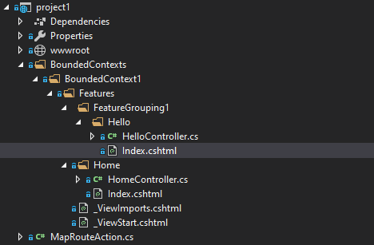
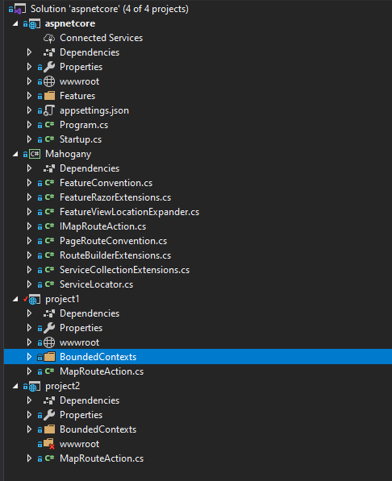

# Introduction

Mahagony is a .NET Core library, supporting composite user interface of ASP.NET Core projects, and vertical slicing of application at user cases and bounded contexts level. Mahogany is pronounced as BrE /məˈhɒɡəni/, NAmE /məˈhɑːɡəni/.

This project demonstrates how to vertical slice a .NET Core application at user interface level. It is a library which modifies the behaviour of routing and view location convention from the default Controllers/Views/Models structure. 

The Mahogany slices an application at two levels, first is at the **user cases** level, using the Features folder convention. The second is at the **bounded context** level, using the BoundedContexts folder convention.


The vertical slicing of bounded context at UI level is very important to fully slice the last mile of bounded context. It is very common that an application is well separated at the entities and user cases layers, but there is no clear boundary at the UI layer. 


# Folder Structure


The folder is structured as the image above.

First, create an MVC project, then convert to library type. Remove all the Controllers/Models/Views folders. And then create the BoundedContexts at the root folder. Then you can create the bounded context below the BoundedContexts. A project can have multiple bounded contexts, but it is advisable to use one project per bounded context to better separate the bounded contexts.

Below the bounded context is Features folder. Add the feature below the Features folder. Below the feature folder, add the controllers, views, view models, Razor pages, and API controllers. Everything about a feature are grouped together, and nicely separated from other features. 

If there are many features, and you would like to divide them into more managable groups, you can create a folder above feature, and below Features folder. Three levels of folders are supported. The image above show that Hello feature is grouped under FeatureGroup1 folder.

The route conventions are as below:
* For controller BoundedContexts.BoundedContext1.Features.Home.HomeController.Index action, the route is /BoundedContext1/Home/Index

* For controller BoundedContexts.BoundedContext1.FeatureGrouping1.Features.Hello.HelloController.Index action, the route is /BoundedContext1/Hello/Index

* For API controller, BoundedContexts.BoundedContext2.Features.Todo.ItemsController.Get action, the route is /BoundedContext2/api/todo. The route attribute of the api is [Route("api/todo")], and BoundedContext2 will be automatically prefixed to the route attribute.

* For Razor page, BoundedContexts.BoundedContext3.Features.Hello.Visitor, the route is /BoundedContext3/Hello/Visitor

Each project must implement IMapRouteAction, and define the route of its project separately from other projects.

Controller name should be the same as feature. For instances, BoundecContexts.BoundexContex1.Features.Home.HomeController, the **Home**Controller has the same name as Home feature.

# Project Structure


The Mahogany supports composite user interface. There is one shell UI (asp.net core), which will load multiple module UI (library). Each module UI must be registered in the shell UI. 

**At ConfigureServices(IServiceCollection services)**
```C#
 var mvcBuilder = services.AddMvc()
    .SetCompatibilityVersion(CompatibilityVersion.Version_2_1)
    // This is to support vertical slicing of controller
    .AddMvcOptions(options => options.Conventions.Add(new FeatureConvention()))
    // This is to support vertical slicing of the views of the controller
    .AddRazorOptions(options =>
    {
        options.ConfigureFeatureFolders();
    })
    // This is to support vertical slicing of Razor pages
    .AddRazorPagesOptions(options =>
    {                    
        options.RootDirectory = "/";
        options.Conventions.Add(new PageRouteConvention());
    });

services.AddProjects(mvcBuilder, MahoganyAssemblies);
```

**At Configure(IApplicationBuilder app, IHostingEnvironment env)**

```C#
app.UseMvc(routes =>
{
    // This is to activate routing of module UI
    routes.MapMahoganyRoute(app.ApplicationServices, MahoganyAssemblies);                
    // Here is the routes for the shell UI
    routes.MapRoute(
        name: "default",
        template: "{controller=Home}/{action=Index}/{id?}");
});

```

**The module UI assemblies**
```C#

private IList<Assembly> MahoganyAssemblies
{
    get
    {
        var mahoganyAssembiles = new List<Assembly>()
        {
            typeof(project1.BoundedContexts.BoundedContext1.Features.Home.HomeController).GetTypeInfo().Assembly,
            typeof(project2.BoundedContexts.BoundedContext2.Features.Home.HomeController).GetTypeInfo().Assembly
        };

        return mahoganyAssembiles;
    }
}

```

---

In the shell UI, there is no BoundedContexts folder, instead the Features folder is at the top level. Any bounded context should be loaded from module UI.




# Vertical Slicing of CSS and Javascript

View layout at module UI can refer to the view layout of the shell UI. 

CSS and Javascript can be shared by defining a symbolic link from the module UI to a folder in the shell UI.

A post compilation script in the module UI will copy the CSS and Javascript from module UI to shell UI.


# Vertical Slicing of Dependency Injection

Each module UI should manage its dependency injection. This can be implemented by the same mechanism of IMapRouteAction.

For shared services, its lifecycle of dependency injection can be managed in the shell UI, and then pass in to the module UI. 


# Demonstration

Set the aspnetcore as start up project, run it.

In the browser, go to the following URL

* http://.../
* http://.../BoundedContex1/Home/Index
* http://.../BoundedContex2/Home/Index
* http://.../BoundedContex3/Home/Index
* http://.../BoundedContex1/Hello/Index
* http://.../BoundedContex2/api/todo
* http://.../BoundedContex2/api/todo/2
* http://.../BoundedContex3/Hello/Visitor


